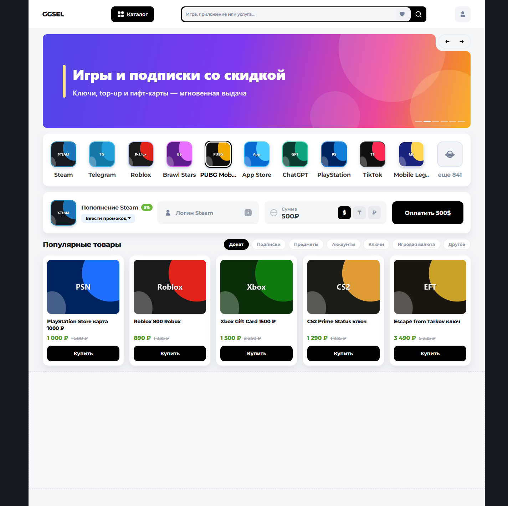
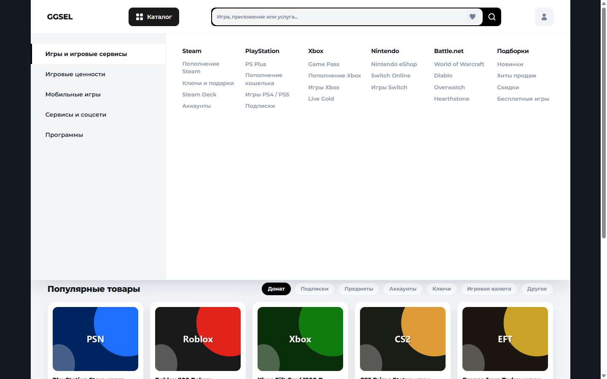
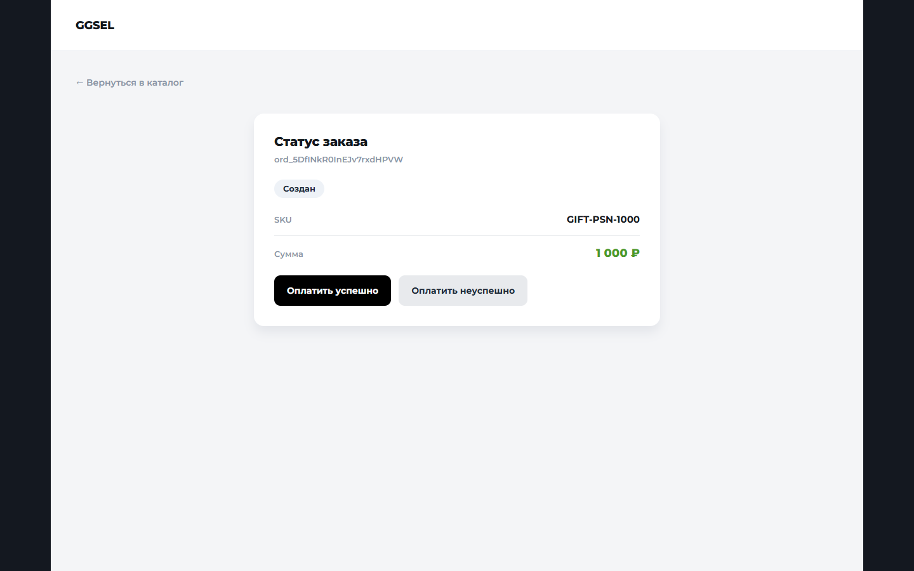
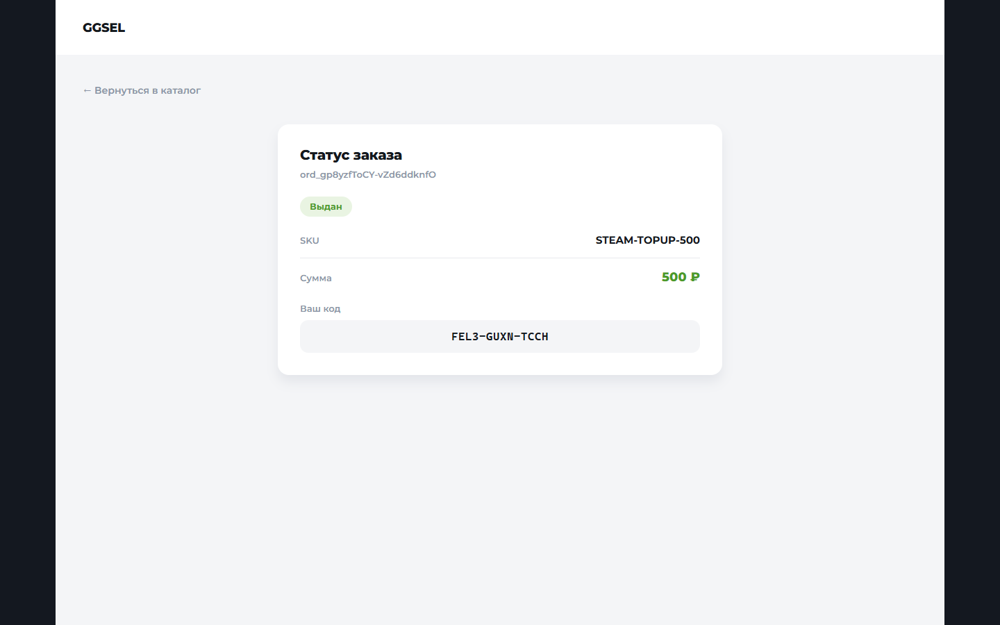

# Digital Marketplace

Магазин цифровых товаров (ключи, topup, подписки, гифт-карты): NestJS API, PostgreSQL (Prisma), витрина на vanilla HTML/CSS/JS в `apps/web`.

**Стек:** NestJS + Prisma/PostgreSQL + vanilla `apps/web`. Без React/Next.

**Промокоды не реализованы** — кнопка «Ввести промокод» на витрине только визуальная.

## Требования

- Node.js 20+
- Docker (только для PostgreSQL)
- npm (monorepo workspaces: `apps/api`, `apps/web`)

## Быстрый старт

### 1. Зависимости и окружение

```bash
npm install
cp .env.example .env
```

Переменные в `.env` соответствуют сервису `db` в `docker-compose.yml` (`DATABASE_URL`, `PORT`, флаги провайдеров A/B).

### 2. PostgreSQL

```bash
docker compose up -d db
```

Поднимается только БД на `:5432`. Сервис `api` в compose есть (profile `api`), но для локальной разработки API удобнее запускать через Nest CLI (см. ниже).

### 3. Миграции и сид

```bash
npx prisma generate --schema=prisma/schema.prisma
npx prisma migrate deploy --schema=prisma/schema.prisma
npx prisma db seed
```

Сид создаёт каталог товаров и пул из 50 общих ключей (`prisma/seed.ts`).

### 4. API (`:3000`)

```bash
npm run start:dev -w @digital-marketplace/api
```

REST под префиксом `/api`. CORS настроен на `http://localhost:8080`.

### 5. Витрина (`:8080`)

```bash
npx serve apps/web -p 8080
```

Откройте [http://localhost:8080](http://localhost:8080). Каталог → заказ → «Оплатить» вызывает `POST /api/orders/:id/simulate-payment` — тот же обработчик, что и платёжный webhook.

## Демонстрация

Витрина (Home V3): шапка, карусель, иконки сервисов, блок Steam, популярные товары. «Купить» создаёт заказ и открывает страницу статуса.



Каталог открывается по кнопке «Каталог», закрывается повторным кликом или кликом снаружи.



Страница заказа (`order.html?id=` / `/order?id=`): статус, SKU, сумма. Для `created` — симуляция оплаты (тот же путь, что webhook).



После успешной оплаты заказ переходит в `delivered`, ключ показывается один раз.



## API (NestJS, префикс `/api`)

База: `http://localhost:3000/api`. JSON. CORS: `http://localhost:8080`.

Ошибки:

```json
{ "statusCode": 404, "traceId": "<из заголовка x-trace-id или отсутствует>", "message": "…" }
```

Типичные коды: `400` валидация, `404` нет ресурса, `409` конфликт (заказ уже есть / retry из недопустимого статуса).

Статусы заказа: `created` | `paid` | `delivering` | `delivered` | `payment_failed` | `out_of_stock` | `delivery_failed`.

Поле `code` в ответах заказа **не null только при** `delivered`.

### `GET /api/products`

Каталог. `stock` — число **свободных** ключей в общем пуле (не per-SKU).

Ответ `200`:

```json
[
  {
    "sku": "STEAM-TOPUP-500",
    "name": "Пополнение Steam 500 ₽",
    "type": "topup",
    "price": 500,
    "currency": "RUB",
    "image": "assets/steam.png",
    "stock": 50
  }
]
```

`type`: `topup` | `key` | `subscription` | `giftcard`.

### `POST /api/orders`

Создать заказ. Цена и валюта берутся из `Product`, не из тела.

Тело:

```json
{ "sku": "STEAM-TOPUP-500", "id": "ord_optional" }
```

`id` опционален. Без него сервер генерирует `ord_…`. С `id` — формат `ord_[A-Za-z0-9_-]+`; если заказ уже есть — `409`. Неизвестный `sku` — `404`.

После вставки в той же транзакции применяются отложенные webhook’и с этим `order_id` (webhook до заказа).

Ответ `201`:

```json
{
  "id": "ord_gp8yzfToCY-vZd6ddknfO",
  "sku": "STEAM-TOPUP-500",
  "status": "created",
  "amount": 500,
  "currency": "RUB",
  "code": null
}
```

### `GET /api/orders/:id`

`404`, если нет заказа.

Ответ `200` — те же поля, что у создания; `code` — строка только для `delivered`.

### `POST /api/orders/:id/simulate-payment`

Заглушка оплаты для UI. Генерирует `event_id` и вызывает **тот же** `handlePaymentWebhook`, что и платёжный webhook. Нет заказа — `404`.

Тело: `{ "status": "paid" }` или `{ "status": "failed" }`.

Ответ `200`: `{ "duplicate": false }` (или `true`, если событие уже обрабатывали — для симуляции обычно новый `event_id`).

`paid` на `created` → выдача ключа (A, при необходимости B). `failed` на `created` → `payment_failed`.

### `POST /api/orders/:id/retry-delivery`

Повтор выдачи. Тело не нужно.

Разрешено из `out_of_stock`, `delivery_failed`, застрявшего `delivering`. Уже `delivered` — `200` с тем же `code` (идемпотентно). Иначе `409`. Нет заказа — `404`.

Ответ `200` — как `GET /api/orders/:id`.

### `POST /api/webhooks/payment`

Входящий webhook платёжки. Подписи нет. `amount` / `currency` / `created_at` **не** перезаписывают сумму заказа.

Тело:

```json
{
  "event_id": "evt_1",
  "order_id": "ord_…",
  "status": "paid",
  "amount": 500,
  "currency": "RUB",
  "created_at": "2026-08-31T12:00:00.000Z"
}
```

`event_id`, `order_id`, `status` обязательны. `status`: `paid` | `failed`.

Ответ всегда `200` при принятом событии:

```json
{ "duplicate": false }
```

| Ситуация | Поведение |
|----------|-----------|
| Повтор того же `event_id` | `200`, `duplicate: true`, без побочных эффектов |
| Заказа ещё нет | Событие в буфер, `200`, выдача не стартует |
| `paid` на `created` | Заказ `paid` → fulfillment; один ключ на заказ |
| `failed` на `created` | `payment_failed` |
| Терминальный заказ | `200`, no-op |

Параллельные `paid` сериализуются на строке заказа: выдачу стартует один победитель.

## Тесты (T1–T10)

Один npm-команда из корня репозитория:

```bash
npm run test:e2e
```

Делегирует в `@digital-marketplace/api` и запускает Jest e2e с фильтром `test/t[0-9]+-` (реальные PostgreSQL через Testcontainers или `TEST_DATABASE_URL`).

## Состязательные сценарии (ручное воспроизведение)

Скрипты в `scripts/` используют **тот же контракт webhook**, что и UI / `simulate-payment`:

`POST /api/webhooks/payment`

```json
{
  "event_id": "evt_…",
  "order_id": "ord_…",
  "status": "paid",
  "amount": 1290,
  "currency": "RUB",
  "created_at": "2026-08-31T12:00:00.000Z"
}
```

Поля `amount`, `currency`, `created_at` опциональны. `status`: `paid` | `failed`.

### F11 — 50 параллельных webhook на один заказ

API должен быть запущен на `:3000`.

```bash
npm run race:webhooks
# → scripts/race-webhooks.ts
# опционально: npm run race:webhooks -- ord_abc123
```

Отправляет 50 параллельных `paid` webhook с **разными** `event_id` (T3). Все 50 должны получить HTTP 200 (скрипт ретраит 5xx/таймауты с тем же `event_id`). События не дубликаты: каждое сохраняется. Выдача ровно один раз: заказ `delivered`, один `code` / `InventoryKey`.

### T6 / F7 — таймаут A, retry с тем же `request_id`

Перезапустите API с флагом:

```bash
PROVIDER_A_FORCE_TIMEOUT_THEN_OK=1 npm run start:dev -w @digital-marketplace/api
```

```bash
npm run race:timeout
# → scripts/timeout-same-request-id.ts
```

Первый вызов провайдера A «таймаутит» после выдачи ключа; повтор с тем же `request_id` возвращает тот же код (второй ключ не списывается).

### T7 / F7 — A недоступен, fallback на B

Перезапустите API с флагом:

```bash
PROVIDER_A_ALWAYS_DOWN=1 npm run start:dev -w @digital-marketplace/api
```

```bash
npm run race:fallback
# → scripts/fallback-a-to-b.ts
```

Выдача уходит на провайдера B с **новым** `request_id` (`req_{orderId}-B`).

## Пополнение склада (F12 / T10)

Когда пул ключей исчерпан, заказ остаётся в `out_of_stock`; после restock — `POST /api/orders/:id/retry-delivery` (кнопка «Повторить выдачу» на витрине).

**Автоматический сценарий T8/T10:**

```bash
npx tsx scripts/empty-pool-retry.ts
```

Скрипт опустошает свободный пул, создаёт заказ, ждёт `out_of_stock`, добавляет ключи `RETRY-KEY1-AAAA` и `RETRY-KEY2-BBBB`, вызывает retry-delivery дважды (второй вызов идемпотентен). Требует `DATABASE_URL`.

**Ручной restock** — helper в `prisma/seed.ts` (`restockInventoryKeys`) или SQL из комментария в том же файле:

```sql
INSERT INTO "InventoryKey" ("code", "sku", "orderId")
VALUES ('RETRY-KEY1-AAAA', NULL, NULL), ('RETRY-KEY2-BBBB', NULL, NULL)
ON CONFLICT ("code") DO NOTHING;
```

После restock — retry-delivery через API или UI.

## Провайдеры A и B (in-process stubs)

Реальные HTTP-сервисы не поднимаются. `ProviderAAdapter` и `ProviderBAdapter` в `apps/api/src/fulfillment/` симулируют `POST /issue` внутри процесса Nest:

| Провайдер | Роль | Настройка |
|-----------|------|-----------|
| **A** | primary | `PROVIDER_A_RETRIES`, `PROVIDER_A_ERROR_RATE`, `PROVIDER_A_TIMEOUT_RATE`, `PROVIDER_A_FORCE_TIMEOUT_THEN_OK`, `PROVIDER_A_ALWAYS_DOWN` |
| **B** | fallback | `PROVIDER_B_ERROR_RATE`; свой `request_id` на заказ |

Общий таймаут вызова: `PROVIDER_TIMEOUT_MS` (по умолчанию 3000 ms). См. `.env.example`.

## Ключевые решения

| Тема | Решение |
|------|---------|
| **Exactly-once выдача** | Идемпотентность по `event_id` (webhook) и `request_id` (провайдер); один ключ ≤ один заказ; транзакции БД |
| **Таймаут ≠ ошибка** | После таймаута результат (`ok` + `code`) уже записан в `ProviderRequest`; retry с тем же `request_id` не аллоцирует второй ключ |
| **Fallback A→B** | Новый `request_id` для B; A и B делят общий пул ключей и store запросов |
| **Webhook до заказа** | Событие буферизуется; при создании заказа с тем же `order_id` применяется отложенный webhook |
| **Масштабирование** | MVP на индексах Prisma/PostgreSQL; при росте — партиционирование/очереди (вне scope) |

## Логирование

Структурированные события (`payment.accepted`, `fulfillment.attempt`, `order.status_changed`). **Не логировать полные коды ключей** в production-логах; код доступен клиенту только в `GET /api/orders/:id` при статусе `delivered`.

## Вне scope (бонусы B1–B4)

| ID | Описание |
|----|----------|
| **B1** | Сверка, фоновая доводка зависших заказов, журнал денег |
| **B2** | Админ-UI списка «оплачен, но не выдан» |
| **B3** | Промокоды (промокоды не реализованы) |
| **B4** | Каталог ×1000, EXPLAIN, нагрузочная оптимизация |

API `retry-delivery` (F12) в MVP есть; админка и промокоды — нет.

## Структура репозитория

```
apps/api/          NestJS API (orders, webhooks, fulfillment)
apps/web/          Статическая витрина (HTML/CSS/JS)
prisma/            Схема, миграции, seed
scripts/           Race/retry сценарии для ручной проверки
docker-compose.yml PostgreSQL (+ опциональный profile api)
```

## Затраченное время

_Часы: ___ (заполнить перед сдачей)_
